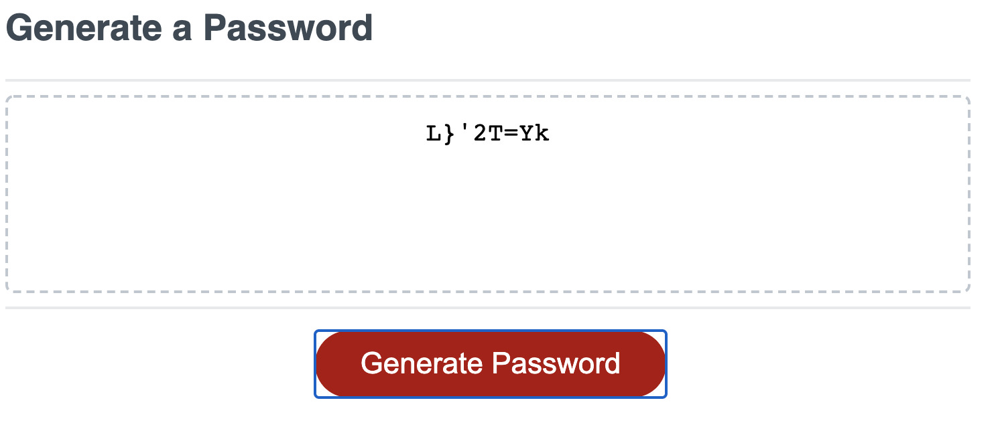

# Password Generator :detective:

## contents

1. Application

- A simple application that will generate strong and secure passwords.

2. Parameters

- Requires you to pick a **Number** between 8 and 128.
- Confirms if you would like lowercase letters in your password.
- confirms if you would like uppercase letters in your password.
- confirms if you would like numbers in your password.
- confirms if you would like special characters in your password.

3. Result

- Returns a randomly generated password given the specified criteria.

# Link

https://icecicle04.github.io/hw-03-JavaScript-Password-Generator/

# Images

PNG:

